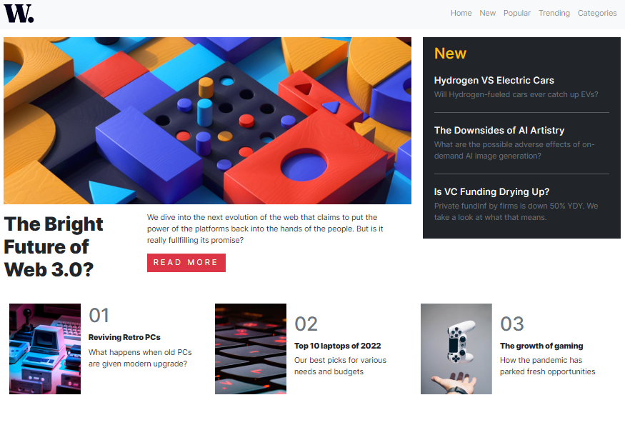

# Frontend Mentor - News homepage solution

This is a solution to the [News homepage challenge on Frontend Mentor](https://www.frontendmentor.io/challenges/news-homepage-H6SWTa1MFl). Frontend Mentor challenges help you improve your coding skills by building realistic projects.

## Table of contents

- [Overview](#overview)
  - [The challenge](#the-challenge)
  - [Screenshot](#screenshot)
  - [Links](#links)
- [My process](#my-process)
  - [Built with](#built-with)
  - [What I learned](#what-i-learned)
  - [Continued development](#continued-development)
- [Author](#author)

## Overview

This is the read me file for this website.
It's a challenge That I found on frontendmentor.
I wanted to code a little project with bootstrap before learning javascript again!

### The challenge

Users should be able to:

- View the optimal layout for the interface depending on their device's screen size
- See hover and focus states for all interactive elements on the page

### Screenshot

This is the screenshot of my solution in a desktop.

### Links

- Solution URL: [https://github.com/winnerndakutemo/newspage]
- Live Site URL: [https://www.newshomepagechallenge2024.netlify.app]

## My process

I started by creating an html structure and then style it with boostrap. Then I added somme
basicall css styles.
But before doing this I "tryed" to make it in other ways but I found that It was better for me
to proced like I explain.

### Built with

- Semantic HTML5 markup
- CSS custom properties
- Mobile-first workflow
- [Bootstrap](https://getboostrap.com/) - Css Framework
  I just wanted to renew with coding cuz it makes sometimes that I didn't touch my computer for coding
  and in road learn bootstrap.

**Note: These are just examples. Delete this note and replace the list above with your own choices**

### What I learned

This challenge helped to have a really great overview about boostrap. It helped me to master
basic layout and page structure. And It's my first website since sometimes so I learned to master again
some features with HTML5 and CSS3.

### Continued development

I'm developping my web developpement ability. I want to grow over and over.
I want to master bootstrap with other challenges and then continue with javascript.

**Note: Delete this note and the content within this section and replace with your own plans for continued development.**

## Author

- Youtube - [Winner Ndakutemo](https://www.youtube.com/@codeavecwinner)
- Frontend Mentor - [@winnerndakutemo](https://www.frontendmentor.io/profile/winnerndakutemo)
- Twitter - [@winnerndakutemo](https://www.twitter.com/winnerndakutemo)
